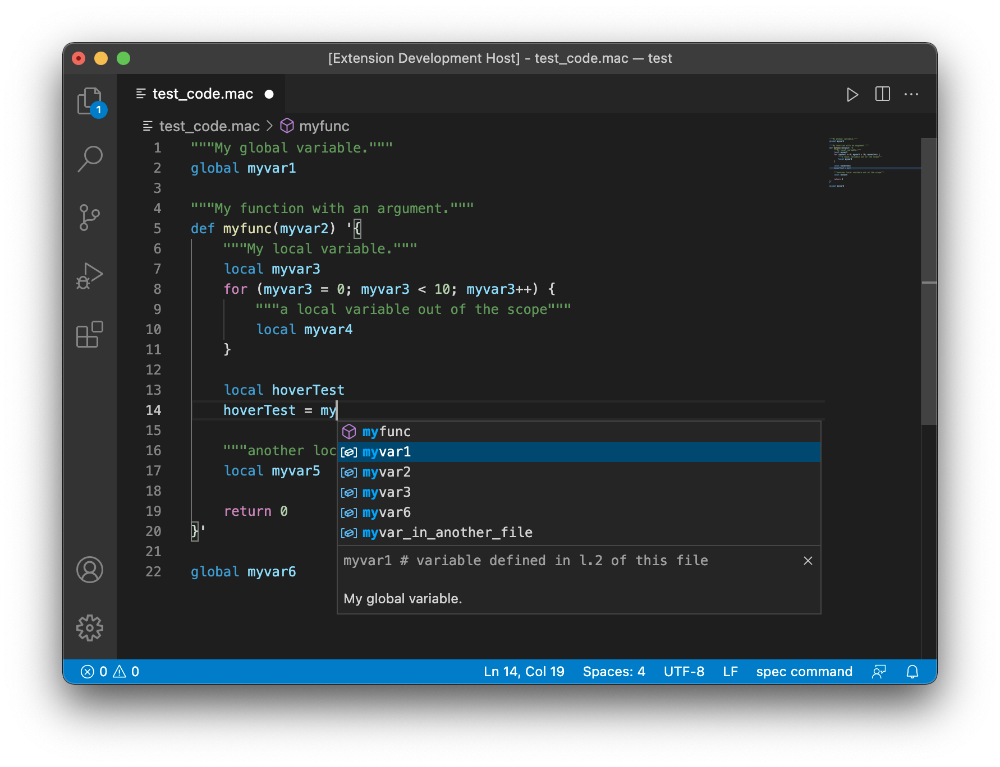

# __spec__ Command File Extension for Visual Studio Code

The extension enhances user experiences in editing __spec__ command files with Visual Studio Code.
The __spec__ command file referred to here is also called __spec__ macro file or __spec__ script file; it is typically loaded by `qdo` standard macro or `qdofile()` built-in function after a user writes user-defined macros and functions in it.

While `qdo` or `qdofile()` does not care about the filename extension, most command files installed with __spec__ are named `*.mac` (e.g., `SPECD/standard.mac`).
Therefore, this VS Code extension treats `.mac` as the file extension of __spec__ command files (language identifier: `spec-command`).
However, VS Code provides ways for a user to change the association.
Read [Language Support in Visual Studio Code](https://code.visualstudio.com/docs/languages/overview) (official document of VS Code) for further details.

## What's __spec__?

> __spec__ is internationally recognized as the leading software for instrument control and data acquisition in X-ray diffraction experiments.
> It is used at more than 200 synchrotrons, industrial laboratories, universities and research facilities around the globe.

_cited from [CSS - Certified Scientific Software](https://www.certif.com) homepage._

Note that the extension is not the official one developed by Certified Scientific Software.
Use [GitHub issues](https://github.com/fujidana/vscode-spec-command/issues) for bug reports and feature requests about the extension.

## Notice for previous version users

The keys of most configuration properties were changed in v1.6.0.
If you have customized the extension behavior, migrate your setting values via the Settings editor or direct access to JSON files.
See [CHANGELOG.md](CHANGELOG.md) for details.
Sorry for inconvenence.

## Features

* __Diagnostics__ - syntax check
* __Syntax highlighting__ - colorizing symbols using a grammer
* __IntelliSense__ - code completion and hinting
  * __Hovers__
  * __Code completion proposals__ - autocompletion that works during a user types a symbol
    * __Code snippets__ - templates that make it easier to enter repeating code patterns, such as loops and conditional-statements
  * __Help with function signatures__ - help that appears during a user types an argument in a function call.
* __Code navigation__
  * __Show all symbol definitions within a document__ - symbol definitions in a file, used in: _Go to Symbol in Editor_ (Ctrl+Shift+O) and the navigation bar below the editor tabs (aka breadcrumbs)
  * __Show definitions of a symbol__ - symbol definitions in open files, used in: _Go to Definition_ (F12) and _Peek Definition_ (Alt+F12) in right-click menu
* __Commands__ - the following commands can be invoked from the command pallate (Ctrl+Shit+P):
  * "Run Seclection/Line in Terminal" and "Run File in Terminal" commands. These commands assume __spec__ interactive shell has been ready in the active terminal view.
  * "Open Reference Manual" command.

This extension treats user-defined symbols declared at the top level (i.e., not in a code block, curly brackets) as global and those in code blocks as local.
Global symbols are visible beyond a file where the symbol is defined; local symbols are visible only when the cursor is in the same block.

Tip: A comment line that starts with `# MARK:`, `# FIXME:` or `# TODO:` is treated as a breadcrumb. Optionally, `--` devides the text with the main and subsidiary parts.



The extension was developed with reference to the recent official PDF document about __spec__ release 6 (version 3 of the spec documentation, printed 16 July 2017).
The help text of built-in symbols are cited from this document, except where otherwise noted.

## Requirements

The __spec__ grammar is torelant and its behavior is determined only at runtime, which makes it impossible for the extension to mimic spec's interpreter perfectly.
For example, the extension regards `f(var)` in a __spec__ script as a function call (like most people assume) but there is another possibility:

```
1.SEPC> def f1(var) '{p var}' # function definition
2.SEPC> f1(123)               # function call, common
123
3.SEPC> f1(123) f1(456)       # invalid syntax
syntax error on ";"

4.SEPC> def f2 '{p "$*"}'     # macro definition
5.SEPC> f2(123)               # macro call, anomalous but valid
(123)
5.SEPC> f2(123) f2(456)       # also valid
(123) f2(456)
```

Macros made of an imperfect statement are another examples the extension can not handle well
(`ifd` and `ifp` defined in `SPECD/standard.mac` are exceptionally supported).
User-defined macros must be made of one or more perfect sentenses.

```
def ifd 'if (DATAFILE != "" && DATAFILE != "/dev/null")'
ifd do_something; else do_otherthing;
```

This extension also requires stricter coding than the __spec__ interpreters does.
For example, __spec__ interpreters evaluate the following two lines equivalently:

```
qdo /home/myuser/mymacro.mac
qdo "/home/myuser/mymacro.mac"
```

but the extension shows an alert on the first line because it expects explicit quotation marks for a string literal.

## Extension Settings

This extension contributes the follwing settings, which are configurable from the _Settings_ windw (`Ctrl+,`):

* `spec-command.suggest.suppressMessages` - controls whether the explanatory text shown by IntelliSense features is suppressed or not.
* `spec-command.suggest.codeSnippets` - provides a place to add code snippet templates that can include special placeholders for motor (`%MOT`) and counter (`%CNT`) mnemonics. Optionally, descriptive text can be appended after a hash sign (`#`). Example: `{ "mv2": "mv ${1%MOT1} ${2:pos1} ${3%MOT2} ${4:pos2} # 2-motor move" }`. For detailed syntax including other placeholders and choices, read [Snippets in Visual Studio Code](https://code.visualstudio.com/docs/editor/userdefinedsnippets). Snippets for `mv`, `mvr`, `umv`, `umvr`, `ascan`, `dscan`, `a2scan`, `d2scan`, `a3scan`, `d3scan`, `a4scan`, `d4scan`,  `a5scan`, `d5scan`, `mesh`, and `dmesh` are defined by the extension and thus, a user does not need to add them manually, except when he/she wants to override default snippet templates.
* `spec-command.suggest.motors`, `spec-command.suggest.counters` - registers motor/counter mnemonics and their explanatory texts as the keys and the values. They are used by IntelliSense features including code snippets above.
* `spec-command.workspace.diagnoseProblems` - controls whther problems of files in workspaces are reported.
* `spec-command.terminal.filePathPrefix` - specifies file path prefix used in "Run File in Active Terminal" command.

The extension also refers to the following built-in settings:

* `files.associations`, `files.exclude`: file patterns to filter target files for symbol search in workspaces
* `files.encoding`: text encoding used in opening files for symbol search in workspaces.

Read [Visual Studio Code User and Workspace Settings](https://code.visualstudio.com/docs/getstarted/settings) for details about the _Settings_ window.

## Known Issues

* Syntax check by this extension has small differences with actual __spec__ interpreters.
* Statement continuation by putting a backslash at the end of the line is not fully supported in syntax highlighting.
* Several text encodings are not supported in symbol serach in workspaces. See GitHub issue #6 for more details.

Also read [GitHub issues](https://github.com/fujidana/vscode-spec-cmmand/issues).
